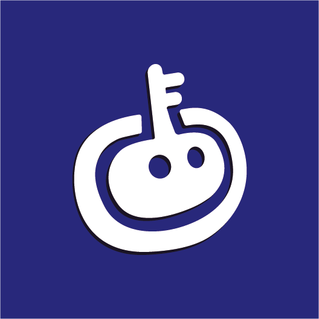

<div align="center">
  
  <h1>Coach</h1>
  <p><strong>一个面向学习项目、作品集项目与实战成长的教练型 Skill</strong></p>
  <p>让 AI 先引导你思考、规划、纠偏，再帮助你高质量完成项目。</p>

  <p>
    
    
    
    
  </p>

  <p>
    
    
    
    
  </p>
</div>

---

`Coach` 是一个用于学习项目、作品集项目、实习项目、校招项目和比赛项目的教练型 Skill。  
它的目标不是替用户把项目更快做完，而是让用户在真实工程语境里学会：

- 先思考，再规划
- 先理解，再实现
- 先自己完成关键部分，再让 AI 加速低杠杆工作
- 在完成后真正讲清楚自己做了什么、为什么这么做

## 核心定位

`Coach` 适合这样的场景：

- 用户想做一个学习项目，但不想被 AI 全程代写
- 用户希望 AI 先引导自己思考架构、业务流、组件拆分、性能、规范、耦合和复用
- 用户希望 AI 按企业实践和优秀开源项目的思路来纠偏
- 用户希望在写完代码后，AI 继续帮助自己理解、复盘，并能讲给别人听

## Quick Start

推荐这样使用 `Coach`：

1. 先告诉 AI 你的项目目标、当前进度和卡点
2. 明确说明你要“教练式引导”，而不是直接代做
3. 如果你要整体规划，再让 AI 帮你梳理计划、划分用户与 AI 的边界
4. 你先完成关键步骤，再让 AI review、纠偏和讲解

示例：

```text
使用 $Coach 一步一步带我做这个学习项目。
我想自己掌握架构和核心业务流。
先帮我 review 我的规划，不要直接开始写代码。
```

```text
使用 $Coach review 我刚完成的这个模块。
请解释它在干什么，为什么这么设计，还有哪些替代方案，
以及我应该怎么理解它、怎么清楚地讲给别人听。
```

## Example Usage

适合的典型请求：

- “先别直接给代码，先帮我看看这个项目规划是否合理。”
- “这个模块我想自己写，你帮我拆成几个步骤。”
- “我写完这一段了，帮我解释这段到底在干什么。”
- “帮我 review 这个学习项目，告诉我哪里像真实工程，哪里 AI 味太重。”

## 它会做什么

- 先听用户自己的思路和规划
- 纠正不合理的架构、职责划分和工程决策
- 在用户明确需要时，和用户一起制定并保存项目计划
- 明确区分：
  - 用户必须自己完成
  - AI 只能引导，不能代做
  - AI 推荐加速完成
  - AI 可直接完成的重复工作
- 在用户完成模块后，按固定结构解释：
  - 这段是在干什么
  - 为什么这么做
  - 好处是什么
  - 还有什么别的做法
  - 为什么这里不优先选别的做法
  - 应该怎么理解
  - 怎么讲给别人听

## 核心原则

- 优先理解，再追求速度
- 优先用户亲自完成，再考虑 AI 代写
- 默认一次只推进一个主要点
- 优先给问题、提示、检查点、骨架，而不是直接给完整答案
- 所有反馈都要锚定用户当前的代码、当前的尝试、当前的卡点
- 用真实工程实践纠偏，而不是只给教材式解释

## 语言行为

- 提示词、追问、讲解、review 的语言会跟随用户所使用的语言自动切换
- 用户主要用中文时，用中文回应
- 用户主要用英文时，用英文回应
- 如果用户混合使用语言，默认跟随任务主体语言，除非用户明确指定

## 适合的触发方式

例如用户说：

- 带我一步一步做这个项目
- 先别直接给代码，先帮我理清规划
- 帮我看看这个学习项目的架构有没有问题
- 我想自己做核心模块，你帮我纠偏和拆计划
- 写完这段后，帮我讲清楚它在干什么

## 文件结构

- `SKILL.md`：Skill 主规则和路由规则
- `agents/openai.yaml`：展示名、默认提示词、图标等元数据
- `references/planning.md`：项目级计划模式，包含问答确认、任务归属、TDD 说明和计划落盘规则
- `references/coaching.md`：当前任务辅导模式，包含写功能、debug、review、讲解的规则
- `references/review-checklist.md`：项目审查清单
- `docs/plans/`：用户确认后保存计划 Markdown 的目录

## 适合谁

- 想靠项目真正提升能力的学生
- 不想被 AI 长期代写到失去手感的人
- 想做出既能交付、又能解释、还能持续迭代的项目的人

## English Version

See [README_EN.md](./README_EN.md).
