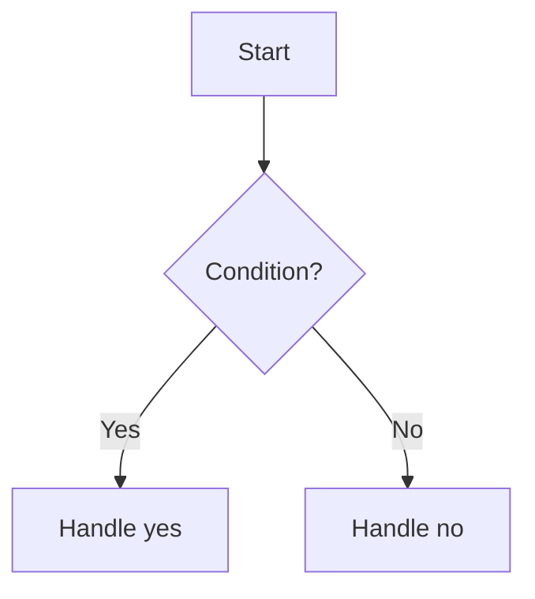

# Module Planning And Execution

Use this reference after the project has been scanned and the user chooses a functional module to continue, organize, or fix.

## Module Discussion

Before editing files, clarify the module plan.

Ask only for missing information that affects implementation:

- What should the module do when finished?
- What user actions start the flow?
- What inputs are required?
- What output or visible result should appear?
- What state changes happen?
- What data must be saved, restored, or deleted?
- What errors or edge cases matter?
- Which existing modules should this connect to?
- What is explicitly out of scope?

If a detail is important and unclear, ask. Do not guess.

## Lifecycle And Recovery

For modules involving files, tasks, drafts, caches, local storage, history, uploads, downloads, or background jobs, clarify lifecycle rules before implementation:

- when temporary or draft data is created
- when it is saved
- when it is deleted
- what happens after cancellation
- what happens after failure
- what happens after app restart
- what happens if a referenced local file disappears
- when to ask the user to relink or repair missing data

## Flowchart Requirement

After the plan is clear, provide two flowcharts before implementation.

### Mermaid Flowchart

Use Mermaid for the structured version.



### Text Visual Flowchart

Also provide a text visual flowchart with indentation, arrows, and `Y/N` branches.

```text
Read input
  ↓
Check option
  ↓
Is option enabled?
  Y -> Use automatic path

  N:
    ↓
    Read user path
    ↓
    Is path empty?
      Y -> Use default path
      N -> Validate suffix
```

The text version should be easy to read as a visual sketch, not a dense paragraph.

## Execution Choice

After the flowcharts, ask:

`Do you want to implement this yourself, or should the Agent implement it according to the confirmed flowcharts?`

Do not edit files before the user answers.

## If The User Implements

Provide:

- ordered implementation steps
- checkpoints
- acceptance criteria
- important edge cases

Do not provide full implementation code. Do not edit files. Keep the user focused on the confirmed module behavior.

## If The Agent Implements

Follow the confirmed flowcharts as constraints.

Rules:

- Implement only the confirmed module change.
- Do not add unrelated features.
- Do not perform broad refactors unless the plan explicitly includes them.
- If a key behavior, lifecycle rule, or edge case is unclear, ask.
- If syntax, framework API, package, or toolchain errors occur, verify with official documentation first. Use reliable web sources only when official docs are insufficient.
- Make the smallest project-appropriate change that satisfies the plan.
- Ignore style-only issues unless they affect behavior or block verification.

## Completion Log

After Agent implementation, create `<project-root>/docs/logs/` if needed and write a Markdown log for the current change.

Use a date and short module name when possible:

`docs/logs/YYYY-MM-DD-<module-name>.md`

The log must include:

- behavior summary
- which plan or flowchart was followed
- modified files
- added files
- purpose of each added file
- deleted files
- `No deleted files` if none were deleted
- unfinished items or user-confirmation points
- validation method or test result

Then report a concise summary to the user.

The user-facing summary is separate from the log. It should be a plain-language feature summary the user can understand and repeat in a project review or interview.

Use this shape when possible:

- `What was completed`: the feature or problem that was finished.
- `What approach was used`: the technical approach or architecture, explained simply.
- `Why this approach`: why it fits this project.
- `What was considered`: important cases, constraints, or failure paths.
- `Why not another way`: one alternative that was not chosen and the simple reason.
- `How it works`: the high-level flow, without dumping implementation details.
- `How to explain it`: one short paragraph the user can say to someone else.

Avoid making the final response only a file list. File lists belong in the log; the chat summary should help the user understand the work.

Use very plain language. If a technical term is useful, explain it immediately in simple words.

After the summary, ask whether the user understood it. Then give a short set of interview-style questions.

The questions should be easy enough to answer from the completed work, but phrased professionally. This helps the user practice translating simple project facts into interview language.

Good question types:

- Why did you choose this implementation approach?
- What problem does this module solve in the overall workflow?
- Which edge cases did you consider?
- What happens if this operation fails halfway?
- If the data size or requirement grows, what would need to change?

## When The User Says Finished

Inspect current files before replying. Do not rely only on the conversation history.

Report:

- what changed in the actual files
- whether the result matches the confirmed plan
- what remains unclear or unfinished
- how the user can verify the module behavior
